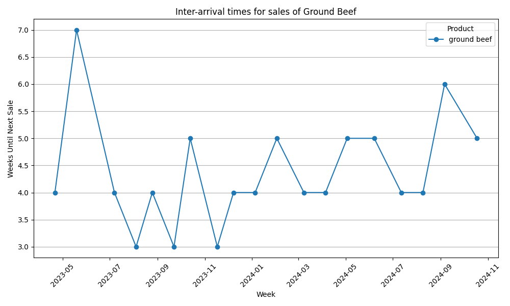
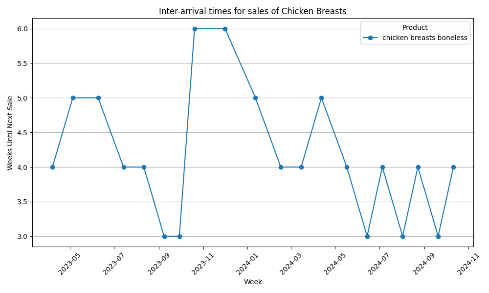

# CS506FinalProject

# To Run Locally
`make install`  
`make run`

# Description   
A data science project that analyzes historic trends in Star Market weekly ad sales in order to predict the next occurrence of a sale on ground beef or chicken breasts.

# Data Description
Weekly ad data was manually extracted from online archives of images of past Star Market weekly ads (https://www.storeopeninghours.com/weekly-ads/star-market) as well as from "Your Weekly Savings" emails sent by Star Market. The data covers 21 months of consecutive weekly ads from March 2023 to December 2024. The rows of the data (data.csv) take the form of (Week, Name, Category, Regular Price, Sale Price). For instance, (10/18/2024, ground beef, meat, 4.99, 3.47). The data primarily focuses on meat items for the sake of sufficient availability and consistency on the weekly ads. 

# Data Processing 
The data is transformed in model.py such that each week is a separate row, with one-hot encoded columns indicating the presence of a sale for each item in the data. Then, using separate models for both ground beef and chicken breasts, columns for the number of weeks since the last sale and the number of weeks until the next sale (as present in the data) are added.

# Data Modeling  
Two separate RandomForestRegressor models from Scikit-learn were trained for ground beef and chicken breasts. Using the one-hot encoded columns for the sales of other items as well as the number of weeks since the last sale, these models predict the number of weeks until the next sale for their respective items. This way, the model can incorporate simple temporal trends of the individual item while also attempting to capture more complex relationships between the presence of sales for different items.

# Results
The results of the predictions can be seen in the interactive flask app. For presentation, the predictions are rounded and displayed in calendar form to represent possible Star Market sale dates (Fridays). A prediction of 2.21 weeks from 2024-12-6, for instance, is displayed as 2024-12-20. For the ground beef model, the mean squared error was 1.40. For chicken breasts, it was 0.64. Example visualizations of the inter-arrival times for sales of ground beef and chicken breasts can be seen below:  

# Reflection
The predictions seem to largely follow the simple average of the inter-arrival times for either ground beef or chicken breasts. While these predictions aren’t wholly inaccurate, I believe that with greater volume of data, it could be possible to achieve better predictions by leveraging more complex relationships between different items or other features. Thus, it may be worth revisiting data collection techniques such as OCR in order to automate collection. That being said, looking at the graphs for the inter-arrival times of sales has, ultimately, allowed me to make more informed decisions over my grocery shopping.
